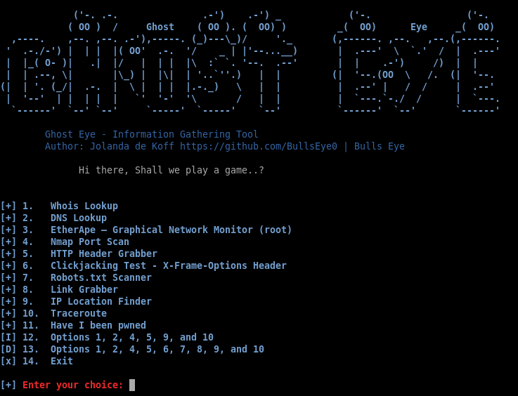

# ghost_eye
Ghost Eye - Information Gathering Tool

Ghost Eye is an Information Gathering Tool I made in python 3. 
To run Ghost Eye, it only needs a domain or ip.
Ghost Eye can work with any Linux distros if they support Python 3.

# Ghost Eye gathers information data such as:

1.   Whois Lookup
2.   DNS Lookup
3.   EtherApe
4.   Nmap Port Scan
5.   HTTP Header Grabber
6.   Clickjacking Test
7.   Robots.txt Scanner
8.   Link Grabber
9.   IP Location Finder
10.  Traceroute
11.  Have I been pwned
12.  Options 1, 2, 4, 5, 9, and 10
13.  Options 1, 2, 4, 5, 6, 7, 8, 9, and 10
14.  Exit

 
You have to install Lynx, JQ, Nmap and EtherApe:

* Fedora: sudo yum install lynx jq nmap etherape
* Arch: sudo pacman -S lynx jq nmap etherape
* Ubuntu: sudo apt install lynx jq nmap etherape
    
# Install Ghost Eye:
* git clone https://github.com/BullsEye0/ghost_eye.git

* cd ghost_eye

  
* pip3 install -r requirements.txt

  
# Use:
* python3 ghost_eye.py

# Contact to coder
Social Networks - Connect

* Facebook: https://www.facebook.com/jolandadekoff

* linkedin: https://www.linkedin.com/in/jolandadekoff/

*  Youtube: https://youtu.be/XCtWM-4ov2U

* Facebook Page: https://www.facebook.com/ethical.hack.group

